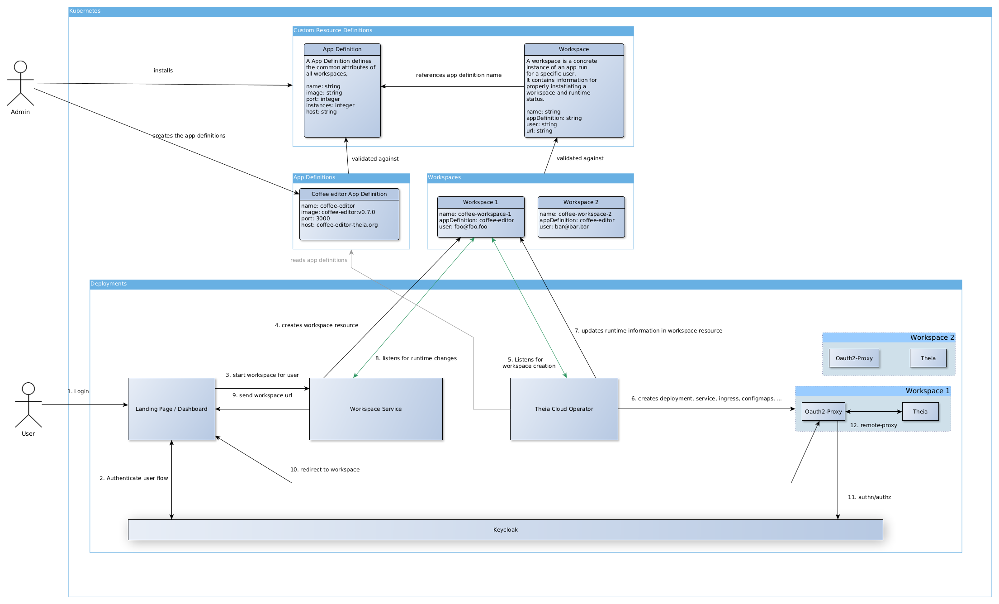
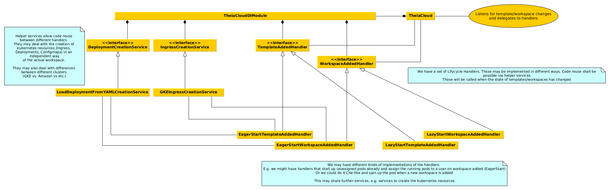

# Architecture Overview

The Theia.Cloud Operator listens for changes to custom resources inside the cluster. With those custom resources clients may trigger the creation/deletion/handling of workspaces. The Operator is responsible for handling all things that are related to the Kubernetes-Resources for workspaces.

## Overall Overview

## Operator Overview

## Operator configuration options

|Option|Type|Used for|
|---|---|---|
|--keycloak|boolean|Whether workspaces will be created with a reverse proxy authing against keycloak|
|--eagerStart|boolean|Whether workspaces will be created before there is a user to speed up starts (not (fully) supported yet)|
|--ephemeralStorage|boolean|Whether workspaces get persisted storage assigned|
|--cloudProvider|null, GKE|Cloud Provider specific configs|
|--bandwidthLimiter|null, K8SANNOTATION, WONDERSHAPER, K8SANNOTATIONANDWONDERSHAPER|How to limit ingress/egress bandwidth|

## Custom Resources

### App Definition

A App Definition describing a specific type of a workspace.\
(Not all properties may be supported by any operator configuration)

|Property|Type|Used for|
|---|---|---|
|name|string|Used to identify the app definition|
|image|string|The container image launched in every workspace based on this app definition|
|port|integer|port to expose|
|host|string|Domain where the workspaces will be available|
|ingressname|string|Name of the ingress where the rules for workspaces will be added|
|minInstances|integer|Instances that should be started eagerly without an existing user|
|maxInstances|integer|Upper bound for number of workspaces that will be launched.|
|killAfter|integer|Workspaces will be killed after this amount of minutes|
|requestsMemory|string|K8s memory requests|
|requestsCpu|string|K8s CPU requests|
|limitsMemory|string|K8s memory limits|
|limitsCpu|string|K8s CPU limits|
|downlinkLimit|integer|Downlink bandwidth limit (kilobits per second)|
|uplinkLimit|integer|Uplink bandwidth limit (kilobits per second)|

### Workspace

A concrete workspace associated with a user

|Property|Type|Used for|
|---|---|---|
|name|string|Used to identify the workspace|
|appDefinition|string|The app definition name on which this workspace is based|
|user|string|The user ID based on which AuthN/Z will be done|
|url|string|The Operator may fill this field with the URL where the workspace is available|
|error|string|The Operator may fill this field with an error message if there was a problem|

## Used technologies in Cluster

Our default implementation is using these technologies:

* oauth2-proxy as a reverse proxy to handle trafic to the running workspace container https://oauth2-proxy.github.io/oauth2-proxy/
* keycloak for authentication/authorization https://www.keycloak.org/

## Workspace Deployment

A workspace deployment consists of two containers. The first container is the IDE. The second container is the oauth2-proxy which acts as a reverse-proxy for the IDE. The oauth2-proxy is further configured via three config maps. The first map simply adds some template HTMLs for login and error cases. The second config map has the configuration for authenticating against KeyCloak. Finally the third configmap is used to update the allowed email addresses which are accepted. Via this third map we restrict access to the user defined in the Workspace resource.
