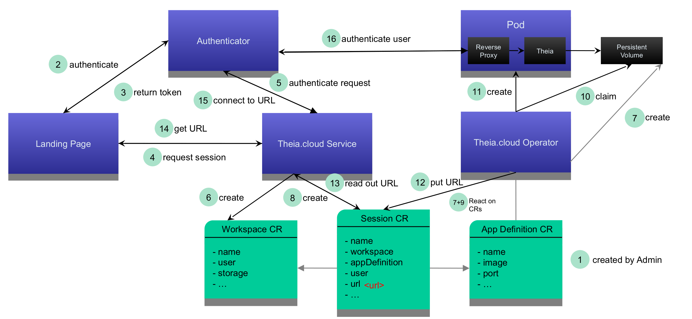

# Architecture Overview

The Theia Cloud Operator listens for changes to custom resources inside the cluster. With those custom resources clients may trigger the creation/deletion/handling of workspaces and sessions. The Operator is responsible for handling all things that are related to the Kubernetes-Resources for workspaces and sessions. All access is authenticated via an Authenticator.

## Operator Java Overview

The Java operator is created via a dependency injection module.
We provide a library (`org.eclipse.theia.cloud.operator`), as well as a default implementation (`org.eclipse.theia.cloud.defaultoperator`) for the operator.
The library can be used to create an operator customized to your use cases.
The default implementation is a production-ready operator that handles most use cases on most cloud providers out of the box and is used in our demos.
If customization is needed, it also serves as an example of how to utilize the operator library.

The following diagram sketches the basic idea.

### Operator configuration options

| Option              | Type                                                            | Used for                                                                              |
| ------------------- | --------------------------------------------------------------- | ------------------------------------------------------------------------------------- |
| --keycloak          | boolean                                                         | Whether sessions will be created with a reverse proxy authenticating against keycloak |
| --cloudProvider     | null, K8S, MINIKUBE                                             | Cloud Provider specific configs                                                       |
| --bandwidthLimiter  | null, K8SANNOTATION, WONDERSHAPER, K8SANNOTATIONANDWONDERSHAPER | How to limit ingress/egress bandwidth                                                 |
| --wondershaperImage | string                                                          | The image of the wondershaper init container                                          |
| --sessionsPerUser   | number                                                          | The number of active sessions a user is allowed to have                               |
| --appId             | string                                                          | The id of the application which sends requests to the REST service                    |
|                     | the following options are not fully supported at the moment:    |
| --eagerStart        | boolean                                                         | Whether sessions will be created before there is a user to speed up starts            |

## Custom Resources

### App Definition

A App Definition describing a specific type of a session.\
(Not all properties may be supported by any operator configuration)

| Property       | Type    | Used for                                                                      |
| -------------- | ------- | ----------------------------------------------------------------------------- |
| name           | string  | Used to identify the app definition                                           |
| image          | string  | The container image launched in every session based on this app definition    |
| port           | integer | port to expose                                                                |
| host           | string  | Domain where the sessions will be available                                   |
| ingressname    | string  | Name of the ingress where the rules for sessions will be added                |
| minInstances   | integer | Instances that should be started eagerly without an existing user             |
| maxInstances   | integer | Upper bound for number of sessions that will be launched.                     |
| timeout        | object  | Sessions will timeout after the according to the specified strategy and limit |
| requestsMemory | string  | K8s memory requests                                                           |
| requestsCpu    | string  | K8s CPU requests                                                              |
| limitsMemory   | string  | K8s memory limits                                                             |
| limitsCpu      | string  | K8s CPU limits                                                                |
| downlinkLimit  | integer | Downlink bandwidth limit (kilobits per second)                                |
| uplinkLimit    | integer | Uplink bandwidth limit (kilobits per second)                                  |

### Workspace

A workspace is a cross-section for a specific application definition, user, and storage.

| Property      | Type   | Used for                                                           |
| ------------- | ------ | ------------------------------------------------------------------ |
| name          | string | Used to identify the workspace                                     |
| label         | string | A human-readable identifier for the workspace                      |
| appDefinition | string | The app definition name on which this workspace is based           |
| user          | string | The user ID that created that workspace                            |
| storage       | string | The name of the persistent storage that is used for this workspace |

### Session

A concrete session associated with a user for a given workspace.

| Property      | Type    | Used for                                                                      |
| ------------- | ------- | ----------------------------------------------------------------------------- |
| name          | string  | Used to identify the session                                                  |
| workspace     | string  | The name of the associated workspace                                          |
| appDefinition | string  | The app definition name on which this session is based                        |
| user          | string  | The user ID based on which AuthN/Z will be done                               |
| url           | string  | The Operator may fill this field with the URL where the session is available  |
| error         | string  | The Operator may fill this field with an error message if there was a problem |
| lastActivity  | integer | The timestamp of the last user activity within this session                   |

## Used technologies in Cluster

Our default implementation is using these technologies:

- oauth2-proxy as a reverse proxy to handle trafic to the running session container <https://oauth2-proxy.github.io/oauth2-proxy/>
- keycloak for authentication/authorization <https://www.keycloak.org/>

## Session Deployment

A session deployment consists of two containers. The first container is the IDE. The second container is the oauth2-proxy which acts as a reverse-proxy for the IDE. The oauth2-proxy is further configured via three config maps. The first map simply adds some template HTMLs for login and error cases. The second config map has the configuration for authenticating against KeyCloak. Finally the third configmap is used to update the allowed email addresses which are accepted. Via this third map we restrict access to the user defined in the Session resource.
